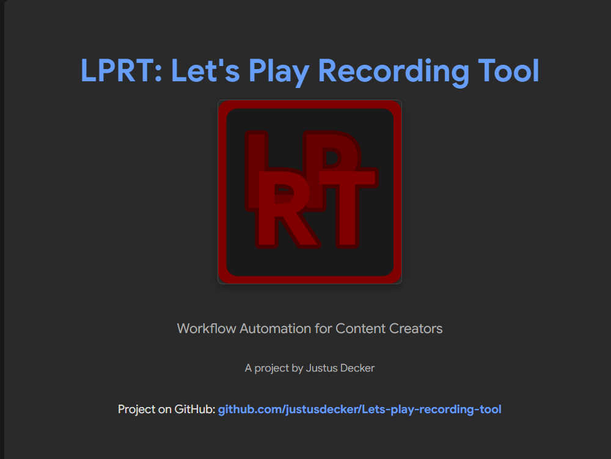

# LPRT

## What is LPRT?

LPRT is a recording, editing & distribution (Automation) Tool for Let's Players like me.

This is a terminal application so you need some terminal experience.

All the data is stored in `csv` & `json`.
Easy access & edit your data using a text-editor or Excel-like apps

[More Info](https://github.com/justusdecker/Lets-play-recording-tool/wiki/)

## Current Development State

Work in progress(pre alpha)

- [x] Terminal Stuff(No practical usage! Only command inputs etc.)
- [x] Recording(Saving Data etc.)
- [x] Automation(Thumbnails)
- [x] Automation(Audio Fetch)
- [x] Automation(Audio Fix)
  - [x] Volume Comare & Set
  - [x] Loudness Normalization
  - [ ] Noise Reduction
- [x] Automation(Combine Video & Audio)
- [ ] Deploy
- [ ] Distribute(COMING SOON!)

> [!CAUTION]
> This Application is still in development, many bugs may appear!(gotta catch them all🦍)
> 
> Some bugs can lead to data loss. **BE CAREFUL!**

The 0.10 update will be the first "Official" one.

This update contains all stuff to make this tool run on any pc
- Bug fixes
- Path problems
- etc.